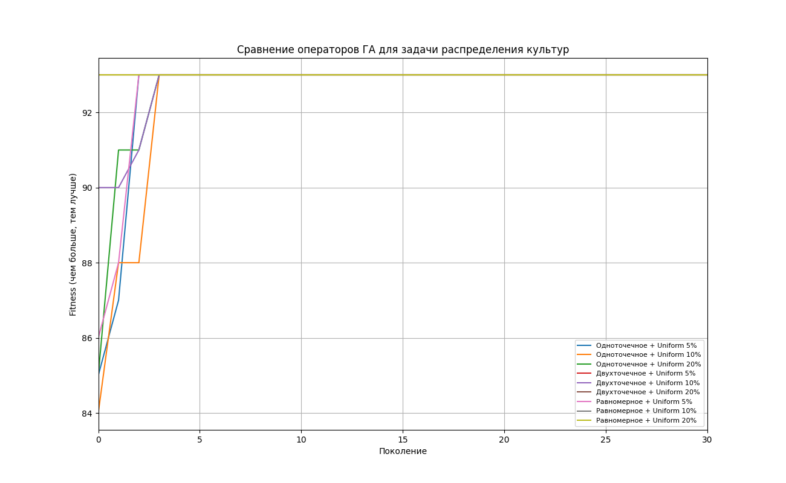
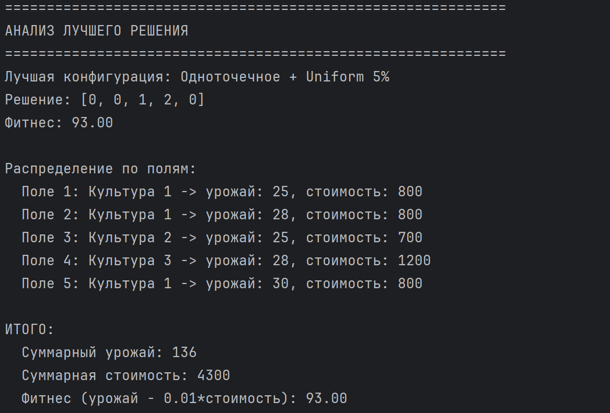

# Лабораторная работа 4. Основы нейронных сетей. Вариант №15
## Задание
Необходимо разработать скрипт, который с помощью генетического алгоритма и полного перебора решает следующую задачу. Дано N полей для и k культур для посева. Для каждого поля известна характеристика урожайности каждой из k культур, а для каждой культуры – её закупочная стоимость. Необходимо получить самый лучший урожай за наименьшую стоимость.

1. Разработать программу на языке python, реализующую генетический алгоритм для распределения сельскохозяйственных культур. Моделирование данных производить на основе максимально правдоподобных данных.
2. Провести эксперименты с разными способами скрещивания, разными способами мутирования. Результат отобразить в виде графиков


## 1) Разработка программы, реализующей генетический алгоритм.
Проведем разбор данных для заданного варианта. Были выбраны 4 сельхоз культуры, каждая из которых имеет свою стоимость на российском рынке (руб/тонна). В матрице урожая была указана разная урожайность культур (центнер/гектар) в зависимости от почвы и её плодородности. 

```
N = 5  # количество полей
k = 4  # количество культур

culture_names = ["Рожь озимая", "Овес", "Пшеница яровая", "Подсолнечник"]
culture_prices = [800, 700, 1200, 2500]  # руб/тонна

yield_matrix = [
    # Рожь  Овес  Пшеница  Подсолнечник
    [25, 18, 22, 12],  # поле 0
    [28, 22, 25, 15],  # поле 1
    [20, 25, 18, 10],  # поле 2
    [22, 20, 28, 18],  # поле 3
    [30, 24, 26, 14],  # поле 4
]
```

Генетический алгоритм — это метод оптимизации и поиска решений, вдохновленный теорией эволюции Чарльза Дарвина. Он имитирует процессы естественного отбора, скрещивания и мутации, которые происходят в живой природе

Популяция - множество возможных решений (population = toolbox.population(n=100) - создание 100 разных вариантов популяций)

Хромосома - одно решение (individual = [2, 0, 3, 1, 2] - каждое число это "ген", который отображает культуру, которую мы хотим посадить на поле)

Фитнес-функция - отражает, насколько хорошее решение (для выбранного варианта: максимизируем (урожай - цена * весовой коэффициент))

Селекция - выбор лучших для размножения (offspring = toolbox.select(population, len(population)) использует турнирный отбор)

Скрещивание - создание потомства между лучшими особями популяции (производится обмен генами между родителями)

Мутация - случайные изменения в генах

```
# Целевая функция: максимизировать урожай, минимизировать стоимость
# Весовые коэффициенты для балансировки целей
YIELD_WEIGHT = 1.0
PRICE_WEIGHT = 0.01


def evaluate(individual):
    total_yield = 0
    total_price = 0

    for field_idx, culture_idx in enumerate(individual):
        # Добавляем урожай с этого поля
        total_yield += yield_matrix[field_idx][culture_idx]
        # Добавляем стоимость культуры
        total_price += culture_prices[culture_idx]

    # Фитнес: максимизируем (урожай - цена * весовой коэффициент)
    # Чем больше значение, тем лучше
    fitness = total_yield - PRICE_WEIGHT * total_price

    return (fitness,)  # DEAP ожидает кортеж


# Настройка DEAP
creator.create("FitnessMax", base.Fitness, weights=(1.0,))  # максимизация
creator.create("Individual", list, fitness=creator.FitnessMax)

toolbox = base.Toolbox()
toolbox.register("attr_int", random.randint, 0, k - 1)  # случайная культура
toolbox.register("individual", tools.initRepeat, creator.Individual,
                 toolbox.attr_int, n=N)
toolbox.register("population", tools.initRepeat, list, toolbox.individual)
toolbox.register("evaluate", evaluate)
toolbox.register("select", tools.selTournament, tournsize=3)

# Операторы скрещивания
crossovers = {
    "Одноточечное": tools.cxOnePoint,
    "Двухточечное": tools.cxTwoPoint,
    "Равномерное": lambda ind1, ind2: tools.cxUniform(ind1, ind2, indpb=0.5)
}


# Операторы мутации
def mut_uniform_int(individual, low=0, up=k - 1, indpb=0.1):
    for i in range(len(individual)):
        if random.random() < indpb:
            individual[i] = random.randint(low, up)
    return (individual,)


mutations = {
    "Uniform 5%": lambda ind: mut_uniform_int(ind, indpb=0.05),
    "Uniform 10%": lambda ind: mut_uniform_int(ind, indpb=0.1),
    "Uniform 20%": lambda ind: mut_uniform_int(ind, indpb=0.2),
}

# Параметры ГА
POP_SIZE = 100
GENERATIONS = 100
CXPB = 0.8
MUTPB = 0.2

# Эксперименты с ГА
print("=" * 60)
print("ГЕНЕТИЧЕСКИЙ АЛГОРИТМ")
print("=" * 60)

results = {}
best_ga_solutions = {}

for cx_name, cx_op in crossovers.items():
    for mut_name, mut_op in mutations.items():

        print(f"\nТестирование: {cx_name} + {mut_name}")

        toolbox.register("mate", cx_op)
        toolbox.register("mutate", mut_op)

        # Инициализация популяции
        population = toolbox.population(n=POP_SIZE)

        # Оценка начальной популяции
        for ind in population:
            ind.fitness.values = toolbox.evaluate(ind)

        best_history = []
        best_individual = None
        best_fitness_ga = float('-inf')

        # Эволюция
        for gen in range(GENERATIONS):
            # Селекция
            offspring = toolbox.select(population, len(population))
            offspring = list(map(toolbox.clone, offspring))

            # Скрещивание
            for i in range(1, len(offspring), 2):
                if random.random() < CXPB:
                    toolbox.mate(offspring[i - 1], offspring[i])
                    del offspring[i - 1].fitness.values
                    del offspring[i].fitness.values

            # Мутация
            for mutant in offspring:
                if random.random() < MUTPB:
                    toolbox.mutate(mutant)
                    del mutant.fitness.values

            # Оценка новых особей
            invalid = [ind for ind in offspring if not ind.fitness.valid]
            for ind in invalid:
                ind.fitness.values = toolbox.evaluate(ind)

            # Замена популяции
            population[:] = offspring

            # Сохранение лучшего результата
            gen_best = max(population, key=lambda ind: ind.fitness.values[0])
            if gen_best.fitness.values[0] > best_fitness_ga:
                best_fitness_ga = gen_best.fitness.values[0]
                best_individual = gen_best[:]

            best_history.append(best_fitness_ga)

        results[f"{cx_name} + {mut_name}"] = best_history
        best_ga_solutions[f"{cx_name} + {mut_name}"] = (best_individual, best_fitness_ga)

        print(f"  Лучший фитнес: {best_fitness_ga:.2f}")
        print(f"  Решение: {best_individual}")

# График сходимости
# График сходимости
plt.figure(figsize=(13, 8))
for label, history in results.items():
    plt.plot(history, label=label)

plt.xlabel("Поколение")
plt.ylabel("Fitness (чем больше, тем лучше)")
plt.title("Сравнение операторов ГА для задачи распределения культур")
plt.legend(fontsize=8, loc='lower right')
plt.grid(True)
plt.xlim(0, 30)

plt.show()

# Анализ лучшего найденного решения
print("\n" + "=" * 60)
print("АНАЛИЗ ЛУЧШЕГО РЕШЕНИЯ")
print("=" * 60)

best_config = max(best_ga_solutions.items(), key=lambda x: x[1][1])
print(f"Лучшая конфигурация: {best_config[0]}")
best_ind, best_fit = best_config[1]
print(f"Решение: {best_ind}")
print(f"Фитнес: {best_fit:.2f}")

# Детальный расчет
print("\nРаспределение по полям:")
total_yield = 0
total_price = 0
for i, culture in enumerate(best_ind):
    yield_val = yield_matrix[i][culture]
    price_val = culture_prices[culture]
    total_yield += yield_val
    total_price += price_val
    print(f"  Поле {i + 1}: Культура {culture + 1} -> урожай: {yield_val}, стоимость: {price_val}")

print(f"\nИТОГО:")
print(f"  Суммарный урожай: {total_yield}")
print(f"  Суммарная стоимость: {total_price}")
print(f"  Фитнес: {PRICE_WEIGHT}*стоимость): {total_yield - PRICE_WEIGHT * total_price:.2f}")
```


## 2) Эксперименты с разными способами скрещивания, разными способама мутирования
Способы скрещивания:
Одноточечное скрещивание - выбирается случайная точка разрыва. Все гены до этой точки берутся от первого родителя, после - от второго
Двухточечное скрещивание - выбираются две случайные точки разрыва. Гены между точками обмениваются между родителями
Равномерное скрещивание - для каждого гена независимо решается, от какого родителя его взять. Вероятность взять ген от каждого родителя = 0.5

Способы мутации:
Uniform 5% - равномерная мутация с вероятностью 5% (Каждый ген может измениться с вероятностью 5%)
Uniform 10% - равномерная мутация с вероятностью 10% (Каждый ген может измениться с вероятностью 10%)
Uniform 20% - равномерная мутация с вероятностью 20% (Каждый ген может измениться с вероятностью 20%)

В ходе экспериментов тестируются все 9 возможных комбинаций:
1. Одноточечное + Uniform 5%
2. Одноточечное + Uniform 10%
3. Одноточечное + Uniform 20%
4. Двухточечное + Uniform 5%
5. Двухточечное + Uniform 10%
6. Двухточечное + Uniform 20%
7. Равномерное + Uniform 5%
8. Равномерное + Uniform 10%
9. Равномерное + Uniform 20%

В ходе экспериментов получаем следующие результаты:
<p align="center">
  
</p>

<p align="center">
  
</p>
