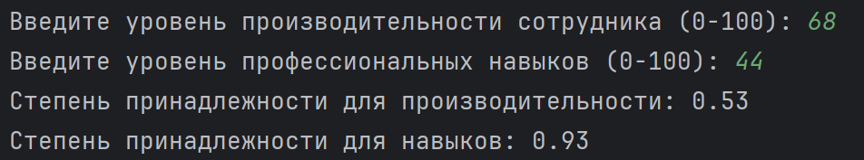
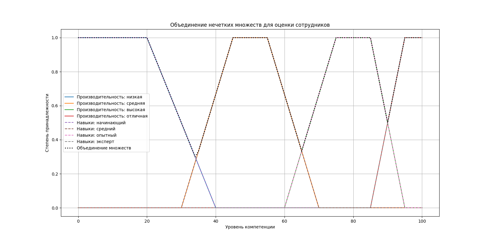

# Лабораторная работа 2. Нечеткая логика. Вариант №15
## Задание
Необходимо разработать скрипт, позволяющий выполнить операцию объединения заданных пользователем нечетких множеств с треугольными функциями принадлежности. Входными данными будут параметры функций принадлежности и четкие объекты для каждого из множеств. Выходными – объединение данных нечетких множеств.

Вариант задания:
Оценка качества работы сотрудников
Производительность: низкая, средняя, высокая, отличная
Профессиональные навыки: начинающий, средний, опытный, эксперт


## 1) Разработка программы, реализующей нечеткую логику.
Нечеткая логика (Fuzzy Logic) — это раздел математики, обобщающий классическую логику и теорию множеств, который оперирует понятием "степени истинности" (от 0 до 1), а не только бинарными значениями "истина/ложь" (0 или 1).

Функция принадлежности — это инструмент нечеткой логики, сопоставляющий каждому элементу универсального множества степень его принадлежности к нечеткому множеству, выраженную числом в интервале [0,1].
Для трапецевидной функции:
a - левая граница (где значение = 0)
b - начало плато (где значение = 1)
c - конец плато (где значение = 1)
d - правая граница (где значение = 0)

Лингвистическая переменная (терм) — это переменная, значениями которой являются слова или фразы естественного языка (например, "высокая", "низкая", "средняя"), а не числа. Она используется для моделирования сложных процессов, где точные количественные данные недоступны, описывая их с помощью качественных характеристик.

Фаззификация – преобразование исходных числовых физических величин в распределения, соответствующие термам лингвистической переменной. 

Основные операции над нечеткими множествами (объединение, пересечение, дополнение) определяются поэлементно через функции принадлежности, обобщая классические множества.

```
import numpy as np
import matplotlib.pyplot as plt

def trapmf(x, a, b, c, d):
    """Трапециевидная функция принадлежности"""
    result = np.zeros_like(x, dtype=float)
    
    for i, val in enumerate(x):
        if val < a:
            result[i] = 0
        elif a <= val < b:
            if b - a != 0:
                result[i] = (val - a) / (b - a)
            else:
                result[i] = 1
        elif b <= val <= c:
            result[i] = 1
        elif c < val <= d:
            if d - c != 0:
                result[i] = (d - val) / (d - c)
            else:
                result[i] = 0
        else:
            result[i] = 0
            
    return result

def interp_membership(x, mf, val):
    """Интерполяция степени принадлежности для заданного значения"""
    idx = np.argmin(np.abs(x - val))
    return mf[idx]

x = np.arange(0, 101, 1)

# Нечеткие множества для производительности
prod_low = trapmf(x, 0, 0, 20, 40)           # низкая
prod_medium = trapmf(x, 30, 45, 55, 70)      # средняя
prod_high = trapmf(x, 60, 75, 85, 95)        # высокая
prod_excellent = trapmf(x, 85, 95, 100, 100) # отличная

# Нечеткие множества для профессиональных навыков
skills_beginner = trapmf(x, 0, 0, 20, 40)        # начинающий
skills_intermediate = trapmf(x, 30, 45, 55, 70)  # средний
skills_experienced = trapmf(x, 60, 75, 85, 95)   # опытный
skills_expert = trapmf(x, 85, 95, 100, 100)      # эксперт

# Ввод данных
prod_val = float(input("Введите уровень производительности сотрудника (0-100): "))
skills_val = float(input("Введите уровень профессиональных навыков (0-100): "))

# Степень принадлежности для производительности
prod_membership = max(
    interp_membership(x, prod_low, prod_val),
    interp_membership(x, prod_medium, prod_val),
    interp_membership(x, prod_high, prod_val),
    interp_membership(x, prod_excellent, prod_val),
)

# Степень принадлежности для навыков
skills_membership = max(
    interp_membership(x, skills_beginner, skills_val),
    interp_membership(x, skills_intermediate, skills_val),
    interp_membership(x, skills_experienced, skills_val),
    interp_membership(x, skills_expert, skills_val),
)

# Объединение множеств производительности
union_prod = np.maximum(prod_low, prod_medium)
union_prod = np.maximum(union_prod, prod_high)
union_prod = np.maximum(union_prod, prod_excellent)

# Объединение множеств навыков
union_skills = np.maximum(skills_beginner, skills_intermediate)
union_skills = np.maximum(union_skills, skills_experienced)
union_skills = np.maximum(union_skills, skills_expert)

# Полное объединение
union_all = np.maximum(union_prod, union_skills)

print(f"Степень принадлежности для производительности: {prod_membership:.2f}")
print(f"Степень принадлежности для навыков: {skills_membership:.2f}")

plt.figure(figsize=(17, 8))

# Производительность
plt.plot(x, prod_low, label="Производительность: низкая")
plt.plot(x, prod_medium, label="Производительность: средняя")
plt.plot(x, prod_high, label="Производительность: высокая")
plt.plot(x, prod_excellent, label="Производительность: отличная")

# Навыки
plt.plot(x, skills_beginner, "--", label="Навыки: начинающий")
plt.plot(x, skills_intermediate, "--", label="Навыки: средний")
plt.plot(x, skills_experienced, "--", label="Навыки: опытный")
plt.plot(x, skills_expert, "--", label="Навыки: эксперт")

plt.plot(x, union_all, ":", label="Объединение множеств", linewidth=2, color="black")

plt.title("Объединение нечетких множеств для оценки сотрудников")
plt.xlabel("Уровень компетенции")
plt.ylabel("Степень принадлежности")
plt.legend()
plt.grid()
plt.show()
```

Для тестовых данных, например производительность = 68, профессиональные навыки = 44, получаем следующие результаты:
<p align="center">
  
</p>

<p align="center">
  
</p>
